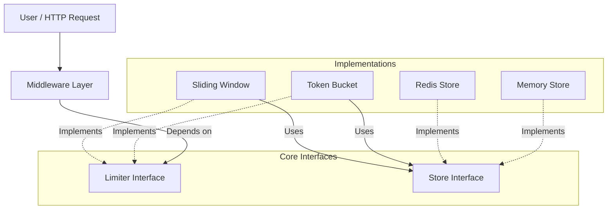

# 🛡️ Sentry

A high-performance, thread-safe, and distributed rate limiter library for Go. Designed with **Clean Architecture** principles, it decouples rate-limiting algorithms from storage backends, making it highly extensible and easy to mock for testing.

Suitable for single-instance applications (In-Memory) and distributed microservices (Redis).

## 🚀 Features

* **Multi-Algorithm Support:**
    * **Token Bucket:** Standard implementation for allowing initial bursts while maintaining a steady rate.
    * **Sliding Window:** Smooths traffic spikes using an approximated sliding window log.
* **Storage Agnostic:**
    * **In-Memory:** Thread-safe, granular locking (mutex-per-key) for high concurrency.
    * **Redis:** Distributed spin-locks using `SET NX` for synchronizing limits across multiple server instances.
* **Framework Ready:**
    * Native adapters for **net/http** (Standard Lib).
    * **Fiber** Middleware.
    * **Echo** Middleware.
* **Robust Testing:** Includes integration tests and `miniredis` support for isolated backend testing.

---

## 🏗️ Architecture

This project follows the **Dependency Inversion Principle**. The core logic depends only on interfaces, allowing you to swap algorithms or storage backends without changing business logic.



## 📂 Project Structure

```text
rate-limiter/
├── algorithms/           # Rate limiting logic (Strategies)
│   ├── tokenbucket/      # Token Bucket implementation
│   └── slidingwindow/    # Sliding Window implementation
├── storage/              # Persistence layer
│   ├── memory/           # Thread-safe in-memory store
│   └── redis/            # Distributed Redis store
├── middleware/           # Framework adapters
│   ├── http/             # Standard net/http adapter
│   ├── fiber/            # GoFiber adapter
│   └── echo/             # Echo adapter
├── examples/             # Runnable examples
├── tests/                # Integration tests
├── limiter.go            # Core interfaces (Contracts)
└── go.mod
```

---

## 📦 Installation

```bash
go get github.com/Aryan123-rgb/rate-limiter
```

## 🆚 Comparison

| Feature | **Sentry** | `golang.org/x/time/rate` | `ulule/limiter` |
| :--- | :---: | :---: | :---: |
| **Algorithms** | Token Bucket, Sliding Window | Token Bucket Only | Token Bucket, Leaky Bucket |
| **Storage** | Memory, Redis (Distributed) | Memory Only | Memory, Redis, Consul, etc. |
| **Distributed Locks** | ✅ Yes (Atomic Spin-Lock) | ❌ No | ✅ Yes |
| **Middleware** | HTTP, Fiber, Echo | ❌ Manual Implementation | HTTP, Gin, Echo, Fiber |
| **Architecture** | **Interface-Based (Plug-and-Play)** | Struct-Based | Struct-Based |
| **Complexity** | Low (Simple Config) | Low | High (Complex Config) |

**Why choose this library?**
* **Simplicity:** You don't need a PhD in config files to set it up.
* **Extensibility:** Want to add Postgres? Just implement the `Store` interface. Want a new algorithm? Implement the `Strategy` interface.
* **Clean Code:** Built strictly following SOLID principles, making it easier to read and maintain than older, bloated libraries.


## ⚡ Quick Start (Standard Library)

Here is a simple example using the **Token Bucket** algorithm with **In-Memory** storage.

```go
package main

import (
    "net/http"
    
    ratelimiter "github.com/Aryan123-rgb/rate-limiter"
    "github.com/Aryan123-rgb/rate-limiter/algorithms/tokenbucket"
    "github.com/Aryan123-rgb/rate-limiter/storage/memory"
    mw "github.com/Aryan123-rgb/rate-limiter/middleware/http"
)

func main() {
    // 1. Setup Storage (In-Memory)
    store := memory.NewStore()

    // 2. Setup Algorithm (Token Bucket)
    // Rate: 10 req/sec, Capacity: 20 (Burst)
    cfg := ratelimiter.Config{Rate: 10, Capacity: 20}
    strategy := tokenbucket.New(ratelimiter.RealClock{})

    // 3. Create Middleware
    // Identify users by IP address
    middleware := mw.RateLimit(strategy, store, cfg, func(r *http.Request) string {
        return r.RemoteAddr
    })

    // 4. Wrap Handler
    handler := http.HandlerFunc(func(w http.ResponseWriter, r *http.Request) {
        w.Write([]byte("Request Allowed!"))
    })

    http.ListenAndServe(":8080", middleware(handler))
}
```

---

## 🌐 Distributed Rate Limiting (Redis)

To scale horizontally across multiple servers, simply swap the storage backend. No algorithm changes are required.

```go
import (
    "github.com/Aryan123-rgb/rate-limiter/storage/redis"
    goredis "github.com/redis/go-redis/v9"
)

// Setup Redis Client
client := goredis.NewClient(&goredis.Options{Addr: "localhost:6379"})

// Use RedisStore instead of MemoryStore
store := redis.NewStore(client)

// Everything else (Strategy, Middleware, Config) remains exactly the same!
```

---

## 🔌 Framework Support

### Fiber

```go
import (
    "github.com/gofiber/fiber/v2"
    limiter "github.com/Aryan123-rgb/rate-limiter/middleware/fiber"
)

app := fiber.New()

// Apply to a specific route group
api := app.Group("/api", limiter.RateLimitMiddleware(strategy, store, cfg, func(c *fiber.Ctx) string {
    return c.IP()
}))
```

### Echo

```go
import (
    "github.com/labstack/echo/v4"
    limiter "github.com/Aryan123-rgb/rate-limiter/middleware/echo"
)

e := echo.New()

// Apply globally
e.Use(limiter.RateLimitMiddleware(strategy, store, cfg, func(c echo.Context) string {
    return c.RealIP()
}))
```

---

## ⚙️ Configuration

The `ratelimiter.Config` struct is shared across algorithms.

| Field | Token Bucket Usage | Sliding Window Usage |
| --- | --- | --- |
| **`Rate`** | The refill rate (tokens per second). | *Ignored (implied by window size).* |
| **`Capacity`** | The maximum burst size (max tokens). | The **Limit** (Max requests per window). |

---

## 🧪 Testing

The project includes unit tests for algorithms and integration tests for middleware. `miniredis` is used to mock Redis interactions, so no external infrastructure is required to run tests.

```bash
# Run all tests (Unit + Integration)
go test ./... -v
```

## 🤝 Contributing

1. Fork the repository.
2. Create a feature branch (`git checkout -b feature/amazing-algo`).
3. Commit your changes (`git commit -m 'Add AmazingAlgo'`).
4. Push to the branch.
5. Open a Pull Request.

---

## 🔮 Incoming Features

I actively working on expanding the capabilities of this rate limiter. Here's what's coming next:

* **More Adapter Support:** Additional middleware adapters for popular frameworks like Gin, Chi, and Gorilla Mux.
* **Framework Integration:** Seamless, plug-and-play integration with all major Go web frameworks.
* **Load Testing Suite:** Comprehensive load testing setup using K6 and Grafana for performance benchmarking and visualization.
* **Monitoring & Observability:** Built-in metrics, tracing, and observability features with Prometheus and OpenTelemetry support.

Stay tuned for updates! ⭐

---

## 📄 License

Distributed under the MIT License. See [LICENSE](LICENSE) for more information.